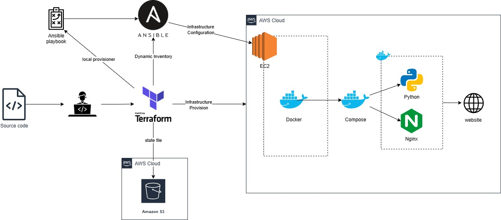

Python application deployment with docker image
======================================

This project demonstrates the integration of Pythondevelopment workflows with terrafrom and Ansible for automated deployment.

